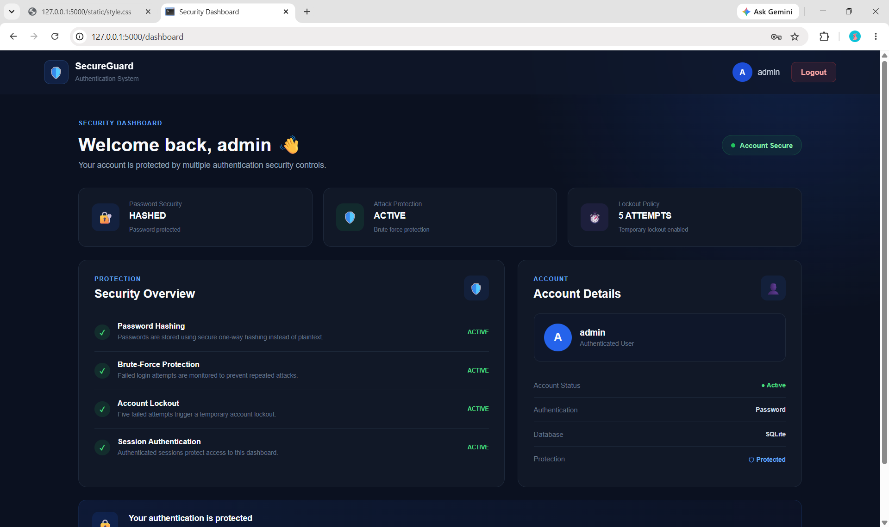
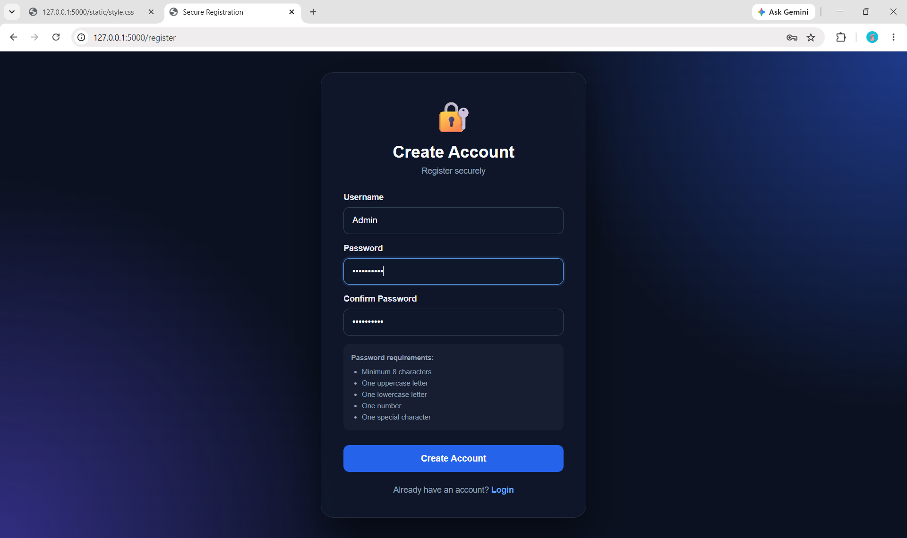
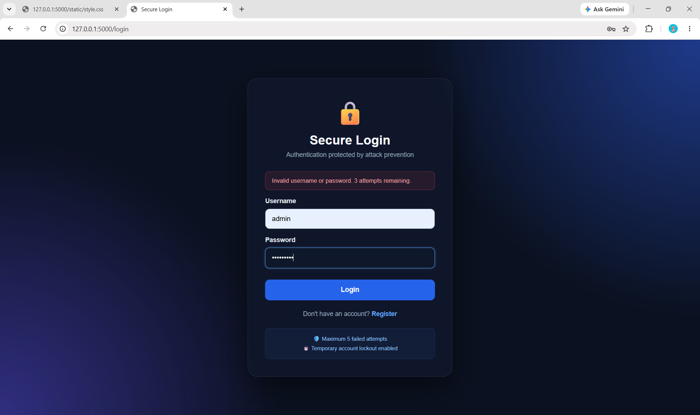

# 🔐 Secure Login System with Attack Prevention

A **Flask-based secure authentication system** designed to protect user accounts against common authentication-related attacks.

The project implements **secure password hashing, password strength validation, session-based authentication, and brute-force attack prevention through temporary account lockout**.

---

## 📌 Project Overview

The Secure Login System provides a complete authentication workflow:

* 👤 User registration
* 🔑 Secure password storage using hashing
* 🛡️ Strong password validation
* 🔐 Secure login authentication
* 🚫 Brute-force attack prevention
* ⏳ Temporary account lockout after repeated failed attempts
* 🎫 Session-based authentication
* 🚪 Secure logout
* 🗄️ SQLite database for user data

The project was developed as a practical cybersecurity application to demonstrate fundamental **authentication and attack-prevention techniques**.

---

## 🎯 Objectives

The main objectives of this project are:

1. Implement a secure user registration system.
2. Never store user passwords in plaintext.
3. Enforce strong password requirements.
4. Prevent repeated password-guessing attempts.
5. Protect authenticated pages using sessions.
6. Provide a simple and user-friendly security dashboard.
7. Demonstrate practical web application security concepts using Python and Flask.

---

## 🛡️ Security Features

### 🔑 Password Hashing

Passwords are never stored directly in the database.

The application uses Werkzeug's password hashing functions:

```python
generate_password_hash()
check_password_hash()
```

This means the database stores a password hash rather than the original password.

---

### 💪 Password Strength Validation

During registration, passwords must satisfy the following requirements:

* Minimum **8 characters**
* At least **one uppercase letter**
* At least **one lowercase letter**
* At least **one number**
* At least **one special character**

Example of a valid password:

```text
Secure@123
```

---

### 🚫 Brute-Force Attack Prevention

The system tracks failed login attempts.

After:

```text
5 failed attempts
```

the account is temporarily locked.

The current lockout duration is:

```text
60 seconds
```

This helps reduce the effectiveness of repeated password-guessing attacks.

---

### ⏳ Account Lockout

When the maximum number of failed attempts is reached, the system records the lockout time in the database.

During the lockout period, further login attempts are rejected.

After the lockout period expires, the failed-attempt counter is reset.

---

### 🔐 Session Authentication

After successful authentication, the username is stored in a Flask session.

Protected pages check whether the user is authenticated before allowing access.

For example:

```python
if "username" not in session:
    return redirect(url_for("login"))
```

This prevents unauthenticated users from directly accessing the dashboard.

---

### 🕵️ Generic Login Error Messages

The system intentionally uses:

```text
Invalid username or password.
```

instead of revealing whether a username exists.

This helps reduce **username enumeration** through login error messages.

---

### 🗄️ Parameterized SQL Queries

Database queries use parameters rather than directly inserting user input into SQL statements.

Example:

```python
conn.execute(
    "SELECT * FROM users WHERE username = ?",
    (username,)
)
```

This helps protect database operations against SQL injection.

---

## 🏗️ System Architecture

```text
                 ┌─────────────────────┐
                 │       User          │
                 └──────────┬──────────┘
                            │
                            ▼
                 ┌─────────────────────┐
                 │   Flask Web App     │
                 └──────────┬──────────┘
                            │
             ┌──────────────┼──────────────┐
             │              │              │
             ▼              ▼              ▼
        Registration      Login         Session
             │              │              │
             ▼              ▼              ▼
       Password        Password        Dashboard
       Validation      Verification
                            │
                            ▼
                  Failed Attempt Counter
                            │
                            ▼
                     Account Lockout
                            │
                            ▼
                     SQLite Database
```

---

## 🔄 Authentication Workflow

### Registration

```text
User enters registration details
            ↓
Validate username
            ↓
Validate password strength
            ↓
Confirm passwords match
            ↓
Hash password
            ↓
Store user in SQLite
            ↓
Registration successful
            ↓
Redirect to Login
```

### Login

```text
User enters credentials
            ↓
Find username in database
            ↓
Check account lock status
            ↓
Verify password hash
       ↙            ↘
   Success          Failure
      ↓                ↓
Reset attempts     Increase attempts
      ↓                ↓
Create session    5 attempts reached?
      ↓             ↙       ↘
 Dashboard       Yes         No
                  ↓           ↓
              Lock account  Retry login
```

---

## 🧪 Attack Prevention Demonstration

The application can be tested against repeated incorrect password attempts.

### Test Scenario

1. Register a user.
2. Enter an incorrect password.
3. Repeat the failed login attempt.
4. Continue until 5 failed attempts are reached.
5. The account becomes temporarily locked.
6. Attempt to log in again during the lockout period.
7. The application rejects the attempt.
8. After the lockout period expires, the user can try again.

Expected result:

```text
Invalid username or password.
```

followed by:

```text
Too many failed login attempts.
Your account has been temporarily locked.
```

---

## 📸 Screenshots

Screenshots are included below to demonstrate the application's interface and security features.

### 🔐 Registration Page


The registration page enforces strong password requirements before creating an account.

---

### 🔑 Login Page


The login page securely authenticates registered users.

---

### 🛡️ Dashboard


After successful authentication, users are redirected to the protected security dashboard.

---

### 🚫 Account Lockout


After multiple failed authentication attempts, the account is temporarily locked to prevent brute-force attacks.

---

### 🗄️ Database

The application uses SQLite for storing user authentication information.

> **Note:** The actual `database.db` file is intentionally excluded from this repository for security and privacy reasons.

---

## 📁 Project Structure

```text
Secure-Login-System/
│
├── app.py
├── requirements.txt
├── .gitignore
│
├── templates/
│   ├── login.html
│   ├── register.html
│   └── dashboard.html
│
└── static/
    └── style.css
```

---

## 🧰 Technologies Used

| Technology | Purpose                   |
| ---------- | ------------------------- |
| Python     | Application programming   |
| Flask      | Web application framework |
| SQLite     | Database                  |
| Werkzeug   | Password hashing          |
| HTML5      | Web page structure        |
| CSS3       | User interface styling    |
| Jinja2     | Flask template rendering  |

---

## ⚙️ Installation

### 1. Clone the repository

```bash
git clone https://github.com/YOUR-USERNAME/Secure-Login-System.git
```

### 2. Open the project

```bash
cd Secure-Login-System
```

### 3. Create a virtual environment

```bash
python -m venv venv
```

### 4. Activate the virtual environment

**Windows:**

```bash
venv\Scripts\activate
```

### 5. Install dependencies

```bash
pip install -r requirements.txt
```

### 6. Run the application

```bash
python app.py
```

### 7. Open the application

Open:

```text
http://127.0.0.1:5000
```

---

## 🧪 Testing Checklist

| Test                           | Expected Result       |
| ------------------------------ | --------------------- |
| Register with weak password    | Registration rejected |
| Register with valid password   | Account created       |
| Register existing username     | Registration rejected |
| Login with correct credentials | Dashboard displayed   |
| Login with incorrect password  | Login rejected        |
| Repeat failed login 5 times    | Account locked        |
| Login during lockout           | Access denied         |
| Access dashboard without login | Redirected to login   |
| Logout                         | Session terminated    |
| Login after successful logout  | Login required again  |

---

## 🔒 Security Considerations

This project demonstrates several important authentication security practices:

* Passwords are hashed rather than stored in plaintext.
* Password complexity is enforced.
* Failed login attempts are tracked.
* Temporary account lockout reduces brute-force attempts.
* Parameterized SQL queries reduce SQL injection risk.
* Sessions protect authenticated routes.
* Generic authentication error messages reduce username enumeration.

### Production Improvements

For a production deployment, additional protections should be implemented, such as:

* Environment variables for secret keys
* HTTPS/TLS
* CSRF protection
* Secure and HttpOnly cookie configuration
* IP/request-based rate limiting
* Multi-factor authentication (MFA)
* Password reset functionality
* Account recovery mechanisms
* Security logging and monitoring
* Stronger session management
* Production-grade database configuration

---

## 🚀 Future Enhancements

Possible improvements include:

* 🔐 Two-factor authentication
* 📧 Email verification
* 🔄 Secure password reset
* 📊 Login activity monitoring
* 📝 Security event logging
* 🚨 Suspicious login detection
* 🌐 IP-based rate limiting
* 👮 Admin security dashboard
* 🔑 Password strength meter
* 🛡️ CSRF protection
* 🔒 Secure cookie configuration

---

## 🎓 Learning Outcomes

Through this project, the following concepts were practiced:

* Web authentication
* Password hashing
* Password security
* Session management
* SQLite database operations
* SQL injection prevention
* Brute-force attack mitigation
* Account lockout mechanisms
* Secure application design
* Flask web development

---

## SCREENSHOTS







### 🗄️ Database Privacy Note

The application automatically creates a `database.db` SQLite database when it is first run. The database stores registered user information, including authentication-related data. For **privacy and security reasons**, the generated database file is intentionally excluded from this GitHub repository using `.gitignore`. Each user running the project can generate their own local database automatically.


## 👩‍💻 Author

**Valentina**

BSc Information Technology
Cybersecurity Enthusiast

---

## ⭐ Project Purpose

This project was developed as part of a **cybersecurity project portfolio** to demonstrate practical implementation of secure authentication mechanisms and attack-prevention techniques using Python and Flask.

If you find this project useful, consider giving the repository a ⭐.
